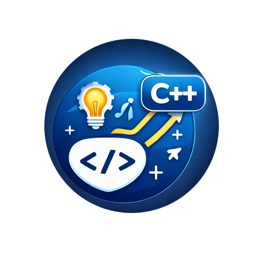

    

<h1 align="center">Competitive Programming 🚀</h1>

This repository contains my **C++ solutions** for practicing **algorithms**, **data structures**, and **competitive programming**.

The main purpose of this repo is to:
- Improve problem-solving skills
- Practice common algorithms and data structures
- Prepare for programming contests and technical interviews

### License

This project is licensed under the terms of the [MIT](LICENSE) license.

